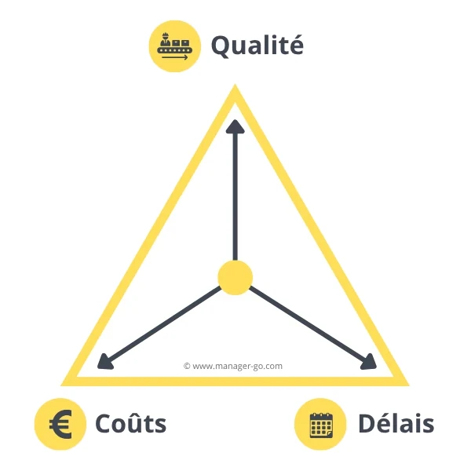
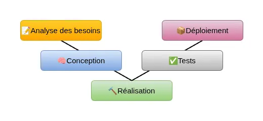
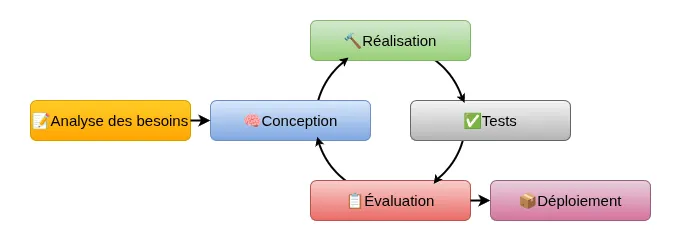
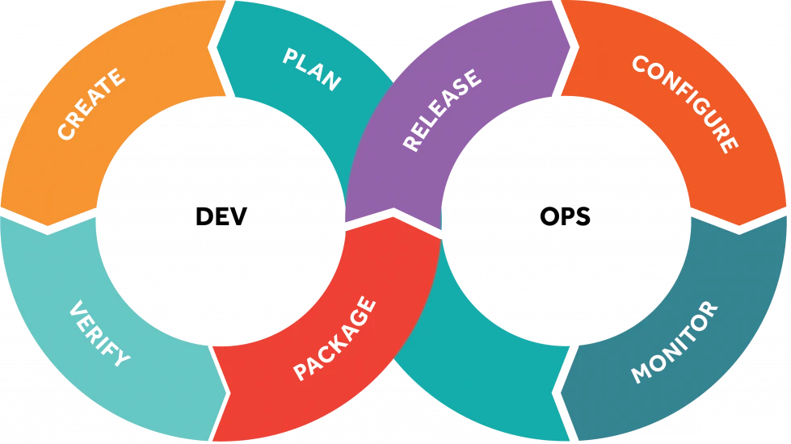

# Gestion de projet

---

## Qu'est-ce que la gestion projet ? 🤔

> La **gestion de projet**, la **conduite de projet**, l'**ingénierie de projet**, ou encore le **management de projet** est l'ensemble des **activités** visant à **organiser** le bon déroulement d’un projet et à en atteindre les **objectifs** en **temps et en heures** selon les objectifs visés.
Elle consiste à appliquer les **méthodes**, **techniques**, et **outils** de gestion spécifiques aux différentes étapes du projet, de l'évaluation de l'opportunité jusqu'à l'achèvement du projet.  
> — [Wikipédia - Gestion de projet](https://fr.wikipedia.org/wiki/Gestion_de_projet)

--

### Version simple

La gestion de projet est une démarche visant à organiser de bout en bout le bon déroulement d’un projet.

---

## Pourquoi gérer un projet ?

- structurer l’activité
- mieux planifier les tâches
- évaluer les risques
- coordonner plusieurs acteurs
- optimiser les ressources
- réduire les imprévus
- documenter les choix
- améliorer la qualité du résultat

--

Les objectifs finaux :

- améliorer la satisfaction du client
- avoir une vision partagée
- pouvoir arbitrer entre alternatives

--

### Gérer les contraintes qualité / coûts / délais

 <!-- .element: style="max-width: 50%" -->

--

Conserver l’équilibre entre :

- la qualité du projet
  - bonne expression des besoins
  - tout au long du projet
  - mécanismes de contrôle qualité
  - **pas que sur le livrable final**
- le coût du projet
  - estimation réaliste puis ajustement
  - coûts d’études
  - coûts de réalisation
  - décisions rapides en cas de dépassement
- le délai de réalisation du projet
  - souvent imposé par le client
  - doit être réaliste et validé par les différents acteurs

---

## C'est nouveau ?

--

### Avant le XXe siècle

Pas vraiment de gestion de projet mais...

- construction des pyramides
- cathédrales médiévales
- routes, ponts, aqueducs
- grandes expéditions scientifiques ou militaires

**Caractéritiques**

- approche empirique
- organisation hiérarchique stricte
- documentation faible
- absence de méthode formelle

--

### Débuts du XXe siècle

Les fondations

- Frederick Taylor (1900–1910) – Organisation scientifique du travail
  - chaque tâche doit être mesurée, optimisée, standardisée
  - influence majeure sur la planification et l’allocation des ressources
- Karol Adamiecki (1866–1933) et Henry Gantt (1910–1915) — Diagramme de Gantt
  - outil visuel pour représenter les tâches dans le temps
  - un des premiers outils modernes de gestion de projet

--

### Années 50

Méthodes de planification

- Méthode CPM (*Critical Path Method*, 1957)
  - développée dans l’industrie chimique (DuPont)
  - objectif : optimiser les délais et les coûts
- Méthode PERT (1958)
  - développée par l’US Navy
  - objectif : gérer des milliers d’activités interdépendantes
  - chemin critique
  - gestion des dépendances

--

### Années 60-80

- Arrivée des systèmes complexes, de l'informatique
  - la gestion de projet devient une **discipline autonome**
- 1956 : modèle de gestion de projet Waterfall (en cascade)
  - plusieurs phases successives
- 1969 : création du [PMI](https://fr.wikipedia.org/wiki/Project_Management_Institute)
  - objectif : standardiser les pratiques
- 1970 : [Winston W. Royce](https://en.wikipedia.org/wiki/Winston_W._Royce)
  - décrit et critique le modèle Waterfall
  - présente le cycle V
  - et les modèles semi-itératifs

--

### Années 90

Explosion de l’informatique et nouvelles méthodes.

Les projets IT deviennent plus rapides, plus changeants, plus complexes.

- Premiers modèles itératifs et incrémentaux
- 1996 : première version du [PMBOK](https://fr.wikipedia.org/wiki/Project_Management_Body_of_Knowledge) par le PMI

--

### Années 2000

- 2001 : [Manifeste Agile](https://agilemanifesto.org/iso/fr/manifesto.html)
  - itérations
  - collaboration
  - retours rapides
  - produit fonctionnel plutôt que documents

L'infrastructure commence à s’en inspirer.

--

### Années 2010-2020

L'IT doit aller **plus vite**, **plus automatisé**, **plus sécurisé** :

- DevOps
  - rapprochement Dev et Ops
  - automatisation (CI/CD)
  - monitoring, fiabilité
- Cloud
  - projets hybrides
- Gestion des risques et de la sécurité
  - EBIOS
  - ISO 27001
  - ANSSI

--

### Aujourd'hui

Gestion de projet hybride / mixte car :

- tout ne peut pas être Agile (ex : migration AD, changement de firewall)
- tout ne peut pas être figé comme dans un cycle en V

Combinaison :

- d'une structure traditionnelle (cycle en V)
- de pratiques agiles (itérations, feedback)

---

---

## Les étapes de la gestion de projet

- 📝 **Définition** : savoir ce que veut le client
- 🧠 **Conception** : savoir ce que l’on va faire
- 🔨 **Réalisation** : faire ce que l’on doit faire
- ✅ **Validation** : le résultat répond-il au besoin
- 📦 **Livraison** : fournir les résultats du projet

---

## Les types de gestion de projet

Principaux modèles d’organisation de projets informatiques

--

### Cycle en V

Chaque phase de conception correspond à une phase de test.

--

 <!-- .element style="display: grid;grid-template-columns: 1fr 1fr; gap: 1rem"  -->

**Avantages**

- très structuré
- documentation complète
- adapté aux projets d’infrastructure

**Limites**

- peu flexible
- complexité si changement tardif
- risque d'un effet tunnel

--

### Cycles semi-itératifs / Agile

Après la phase d'analyse, on produit par incrémentations courtes.

--

 <!-- .element style="display: grid;grid-template-columns: 1fr 1fr; gap: 1rem"  -->

**Avantages**

- flexibilité
- adapté aux environnements changeants
- retours rapides

**Limites**

- moins de documentation
- nécessite une bonne maturité d’équipe
- difficile à mettre en place pour les grands projets

--

### DevOps

Fusion des activités **Dev** et **Ops** pour livrer plus vite et mieux.

⚠️ Ce n'est pas vraiment de la gestion de projet, mais les principes sont très utilisés en Agile

 <!-- .element style="max-width: 50%;background-color: #fff; padding: .75rem" -->

--

**Piliers**

- automatisation
- intégration continue
- supervision
- culture collaborative

DevOps n’existe pas sans une chaîne outillée cohérente : CI/CD, IaC, monitoring, automatisation.

 <!-- .element style="display: grid;grid-template-columns: 1fr 1fr; gap: 1rem"  -->

**Avantages**

- qualité constante
- rapidité
- réduction du risque humain

**Limites**

- nécessite outils et culture
- pas adapté à tous les environnements
- mise en place peut être complexe

---

## Conclusion

Un projet est une démarche organisée qui répond à un **objectif unique** dans un **temps défini** avec des **ressources limitées**.

L’IT demande une gestion rigoureuse parce que les projets sont complexes, impliquent plusieurs équipes, doivent garantir la disponibilité et la sécurité et évoluent très vite.

Une bonne gestion de projet permet de réduire les risques et d'avoir plus de réussite.

Gérer un projet, ce n’est pas seulement faire un planning.
C’est **anticiper**, **communiquer**, **documenter**, et **mener une équipe vers un objectif clair**.