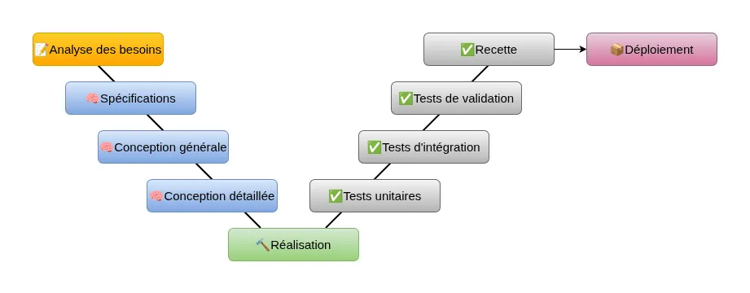
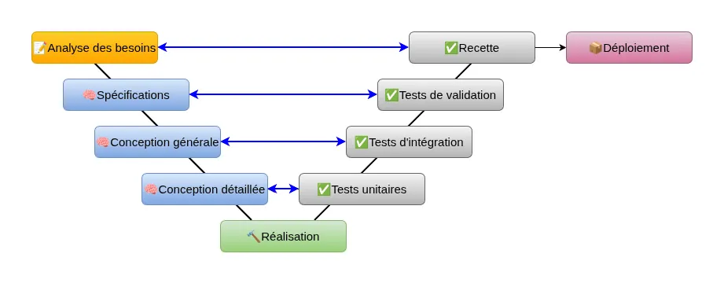

# Cycle en V

---

## C'est quoi ?

C'est un modèle d'organisation de projet qui améliore le cycle en cascade (*waterfall*).

--

Chaque phase de conception est associée à une phase de contrôle

--

On retrouve les étapes classiques d'un projet, ces étapes peuvent avoir plusieurs sous-étapes :

- 📝 **Définition** : savoir ce que veut le client
- 🧠 **Conception** : savoir ce que l’on va faire
- 🔨 **Réalisation** : faire ce que l’on doit faire
- ✅ **Validation** : le résultat répond-il au besoin
- 📦 **Livraison** : fournir les résultats du projet

--

Cas d'usages généraux :

- développement logiciel
- industrie lourde (automobile, aviation, militaire)
- certains projets IT / infrastructures

--

Dans l'IT, s'applique bien pour :

- les migrations ou déploiements d'infrastructures (refonte d'un LAN, migration d'un cœur de réseau)
  - nécessite une bonne analyse du besoin, du mode opératoire, des tests complets et une validation stricte (latence, débit, redondance...)
- mise en place d’une infrastructure virtualisée
  - l'architecture doit être définie avant construction, intégration complexe, tests indispensables
- déploiement ou migration de solutions de téléphonie / VoIP
  - contraintes importantes, tests indispensables avant bascule, déploiement par lots

--

Le cycle en V fonctionne bien pour l'infrastructure car :

| Caractéristique                      | Pourquoi c’est idéal pour l’infra ?                     |
| ------------------------------------ | ------------------------------------------------------- |
| **Prévisibilité**                    | Matériel, délais de livraison, compatibilité connue     |
| **Forte dépendance technique**       | Nécessité d’un design préalable                         |
| **Faible incertitude fonctionnelle** | Besoins stables, peu changeants                         |
| **Tests structurés**                 | Recettes techniques et intégrations formelles            |
| **Environnements complexes**         | Préparation nécessaire pour minimiser les interruptions |

--

Globalement bonne méthode projet quand on a le besoin de :

- planification stricte
- documentation complète
- validation et tests très cadrés
- peu d’allers-retours fonctionnels

---

## En pratique

Le cycle en V se déroule sous forme d'étapes, utilise des outils et chaque acteur du projet a un rôle.

--

### Les acteurs / les rôles

#### MOA

Maîtrise d'ouvrage, c'est le client (le demandeur du projet). Ses responsabilités :

- détermine les objectifs du projet
- estime et alloue un budget
- fixe les délais de livraison
- anime les différentes réunions
- valide les étapes du projet
- participe à la recette

La MOA connaît le métier, donc le besoin.

--

#### MOE

Maître d'œuvre, chargé de le conception et de la réalisation du projet. Ses responsabilités :

- assiste la MOA
- sélectionne et gère l'équipe de réalisation
- assure la qualité du produit
- rend compte de l'avancement
- tient les délais et le budget

La MOE connaît la technique.

--

#### AMOA / AMOE

Sur des projets complexes, chacune des parties peut-être accompagnée par un intermédiaire chargé de fluidifié les relations et d'analyser en détail les contraintes, les risques...

- AMOA : assistant à maîtrise d'ouvrage
- AMOE : assistant au maître d'œuvre

--

Dans une petite structure, petite DSI, classiquement :

- MOA : direction / métier / responsable informatique
- MOE : admins / ingénieurs / prestataires

--

Au sein de chaque partie, on peut définir des rôles spécifiques, dont :

- **sponsor** : référent qui représente le client, fait le lien entre l’équipe projet et le client
- **responsable fonctionnel** : chargé de la définition du projet
- **chef de projet** : en charge de coordination, planification, du suivi
- **administrateur / ingénieur** : réalise les installations, configurations, tests
- **RSSI** : gère les aspects sécurité informatique et conformité
- **utilisateurs finaux** : réalisent la recette, la validation

Une équipe bien structurée, avec des rôles et responsabilités bien établis, connus, acceptés et compris permet d'avancer sereinement.

L'ensemble des acteurs est appelé **parties prenantes**.

--

### Les étapes et outils

--

#### Avant le projet

Avant le démarrage du projet, l’entreprise peut commencer à le définir de façon “macro” :

**expression du besoin**

- le but / la raison d'être du projet
- le contexte
- le périmètre, entre autre dates de début et fin du projet
- les délais et jalons clés
- les acteurs du projet
- les contraintes et risques potentiels
- les impacts éventuels (par exemple sur l'entreprise)

--

Avant le démarrage du projet, l’entreprise peut commencer à le définir de façon “macro” :

**étude d'opportunité**

- analyse de la situation (stratégie de l'entreprise, facteurs clés de succès…)
- le contexte
- les résultats attendus
- les opportunités à saisir (nouveaux marchés…)
- options envisageables / scénarios
- recommandations (pistes) issues de l'étude

--

Avant le démarrage du projet, l’entreprise peut commencer à le définir de façon “macro” :

**étude de faisabilité**

- qualité à atteindre
- délais à respecter
- coûts
- ressources et contraintes :
  - techniques
  - financières
  - temporelles

--

Avant le démarrage du projet, l’entreprise peut commencer à le définir de façon “macro” :

- **expression du besoin** : ce que l’on veut
- **étude d’opportunité** : pourquoi, ce que ça apporte
- **étude de faisabilité** : est-ce réalisable

Livrable : **note de cadrage**

Cette phase est plus ou détaillée selon l’entreprise, le projet…

La [méthode QQOQCCP](https://fr.wikipedia.org/wiki/QQOQCCP) (Qui ? Quoi ? Où ? Quand ? Comment ? Combien ? Pourquoi ?) peut aider lors de cette phase.

--

La note de cadrage peut contenir :

- le but du projet
- le contexte
- le périmètre (ce qui est inclus et exclu du projet)
- les acteurs identifiés
- les contraintes
- les risques (souvent au niveau de l'organisation plus que du projet)
- les opportunités
- les impacts

C'est un document d'avant projet. Il permet d'avoir une base de travail pour le projet et ses orientations.

--

#### Définition du projet 📝

Les MOA et MOE définissent plus précisément le projet en s’appuyant sur les parties prenantes.

Le but est de définir précisément :

- les objectifs
- la reformulation des besoins
- l’analyse des risques
- la planification
- le budget
- le cahier des charges en tant que document de synthèse

--

**Définition du projet 📝**

Le but est de définir précisément :

**les objectifs**

- prise en compte de la note de cadrage
- échanges avec la direction
- ateliers de réflexion

--

**Définition du projet 📝**

Le but est de définir précisément :

la **reformulation des besoins**

- interview du client
- ateliers de réflexions et d’idéation
- observations sur le terrain

--

**Définition du projet 📝**

Le but est de définir précisément :

l’**analyse des risques**

- évaluation des risques du projet
- évaluation des critères de limitation des risques
- [matrice des risques](https://fr.wikipedia.org/wiki/%C3%89valuation_des_risques)

--

**Définition du projet 📝**

Le but est de définir précisément :

la **planification**

- [PBS](https://fr.wikipedia.org/wiki/Structure_de_d%C3%A9composition_du_produit) : découpage du produit
- [WBS](https://fr.wikipedia.org/wiki/Organigramme_des_t%C3%A2ches_du_projet) : découpage des tâches du projet
- [matrice RACI](https://fr.wikipedia.org/wiki/RACI) : rôles et responsabilités des parties prenantes
- [diagramme de Gantt](https://fr.wikipedia.org/wiki/Diagramme_de_Gantt) : durée des tâches, enchaînement des tâches, jalons, assignation des personnes

--

**Définition du projet 📝**

Le but est de définir précisément :

le **budget**

- budget détaillé
- indicateurs de suivi

--

**Définition du projet 📝**

Le but est de définir précisément :

le **cahier des charges**

- document exhaustif de définition du projet
- livrable qui constitue le contrat entre le client et le fournisseur

--

**Définition du projet 📝**

Le cahier des charges est :

- un document 📝
- un modèle de clarté et de précision 🎯
- un contrat entre le client et le fournisseur 🤝

--

**Définition du projet 📝**

Le cahier des charges doit contenir :

- présentation du projet, du contexte
- la description des besoins attendues
- les limites du projet
- les contraintes
- les prestations attendues
- l'organisation
- le budget
- les délais

--

#### Conception du projet 🧠

Définition de toutes les informations nécessaires à la réalisation du projet. Le détail de la conception est très spécifique au domaine du projet !

On peut y trouver plusieurs livrables :

- spécifications fonctionnelles
- spécifications techniques
- maquettage ou prototypage

--

**Conception du projet 🧠**

On peut y trouver plusieurs livrables :

**spécifications fonctionnelles**

- description détaillée du besoin
- cas d’usage / cas d’utilisation
- scénarios utilisateurs / matériel
- exigences de sécurité
- exigences de performance

--

**Conception du projet 🧠**

On peut y trouver plusieurs livrables :

**spécifications techniques**

- architecture détaillée (schéma réseau, système, de stockage...)
- choix techniques et justifications (tel *firewall* parce que...)
- caractéristiques matérielles (processeur, serveur, RAM)
- caractéristiques logicielles (OS, versions minimales)
- configuration réseau détaillée
- configuration sécurité détaillée

--

**Conception du projet 🧠**

On peut y trouver plusieurs livrables :

**maquettage ou prototypage**

qui permet de :

- valider une architecture avant déploiement réel
- tester une migration sans impacter la production
- comparer plusieurs solutions techniques
- vérifier les performances attendues
- tester un plan de reprise ou de bascule

--

#### Réalisation du projet 🔨

On réalise le besoin. Cette phase dépend du secteur d’activité.

Là, c'est le cœur du métier !

On n'oublie pas de documenter ce que l'on fait ni d'appliquer les bonnes pratiques.

--

#### Validation du projet ✅

On vérifie que le résultat correspond au besoin. Dépend du domaine d’activité.

On peut y trouver les livrables :

- validation technique
- tests de charge / de performance / d'exploitation / de sécurité
- cahier de recette

--

**Validation du projet ✅**

Les tests dépendent de la nature du projet. On peut y retrouver :

- **tests fonctionnels** : valident la conformité par rapport aux spécifications fonctionnelles
  - création de compte AD
  - connexion VPN
  - accès réseau selon profil
- **tests techniques** : valident le comportement technique de l’infrastructure
  - performance du stockage
  - test haute disponibilité
  - latence réseau
- **tests de sécurité** : valident la conformité du système
  - tests d’authentification
  - scans vulnérabilités
  - contrôle des droits NTFS / ACL

--

**Validation du projet ✅**

- Le cahier de recette peut inclure :
- plan de recette
- scénarios de test
- jeux de données
- prérequis (réseaux, comptes, droits)
- règles de validation
- gestion des anomalies

--

#### Livraison du projet 📦

On fournit le produit au client. Dépend du domaine d’activité.

On peut y trouver les livrables :

- dossier d’architecture final (DAF)
- dossier d’exploitation
- manuel d’administration
- documentation de bascule (pour PRA/PCA)
- planning de maintenance
- scripts, fichiers de configuration, supervision

--

#### REX

Lorsque le projet est terminé, il est intéressant de faire un retour d'expérience.

Il ne s'agit pas uniquement de se féliciter (ou l'inverse), mais surtout d'analyser ce
qui s'est bien déroulé, mal dérouler et d'en comprendre les causes et les conséquences.

L'objectif est de s'améliorer sur le prochain projet.

---

## Synthèse

Le cycle en V c'est :

- prévisibilité
- structure
- documentation
- tests
- peu de flexibilité

--

Ce sont aussi ces limites :

- peu adapté aux besoins changeants
- beaucoup de documentation nécessaire
- effet tunnel important
- validation tardive

---

## Conclusion

Le cycle en V est un **modèle structuré**, **prévisible** et **rigoureux**.
Il est bien adapté aux projets dont le besoin est **clair et stable**, où les contraintes sont **techniques et fortes** et pour lesquels la qualité et la sécurité sont **non négociables**.

Il permet une **bonne maîtrise des risques**, une **documentation complète** et une **vision claire** pour toutes les parties prenantes.

Mais il implique aussi **moins de flexibilité**, **plus de formalisme** et des **cycles** qui peuvent être **longs**.
