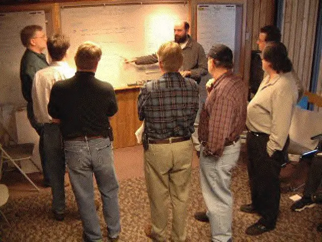

# Agile

---

## Pourquoi ?

Issu du monde du développement logiciel

Depuis les années 50 de nombreuses méthodes de gestion de projet existent

Les projets sont souvent complexes et échouent, en 1994*

- 31% sont stoppés 😰
- 52% dépassent de 189% le budget prévu 😧
- mais 16% réussissent dans les coûts et délais 😇

<small>* [Chaos Repport 1994](https://www.cs.nmt.edu/~cs328/reading/Standish.pdf) du [Standish Group](https://fr.wikipedia.org/wiki/Standish_Group)</small>

--

## Comment ?

- 2001 : 17 personnalités du développement logiciel se réunissent
- échangent sur les problèmes projets et leurs méthodes
- déterminent des critères communs et principes
- de cette réunion émerge le [Manifeste agile](https://agilemanifesto.org/iso/fr/manifesto.html)

 <!-- .element style="max-width: 35%"-->

---

## Le [Manifeste](https://agilemanifesto.org/iso/fr/manifesto.html)

--

### Résumé

- forte implication du client
- réactivité face à la demande
- développement itératif
- production incrémentale
- production adaptative
- validation à chaque étape
- autonomie des équipes

--

### C'est quoi le Manifeste ?

- une approche
- une philosophie
- une démarche

**Ce n'est pas**

- une méthode projet
- une structure d’organisation

=> le Manifeste sert de base intellectuelle à des méthodes

**La méthode Agile n'existe pas !**

--

### Attention !

**Agile ce n’est pas l’anarchie !**  
On **DOIT** organiser, structurer, documenter !  
D’ailleurs les projets agiles exigent discipline et rigueur.

**Ce n’est que pour le développement logiciel !**  
Ça vient du logiciel, mais les cadres agiles peuvent s’appliquer à différents domaines.

**Ça ne fonctionne pas !**  
Si si, mais il faut bien appliquer les cadres pour avoir des résultats !

--

### Quand utiliser un cadre Agile ?

- quand un besoin n’est pas complètement identifié
- quand le besoin peut varier
- quand on doit tester / expérimenter / innover

**Et que le client est disponible et prêt à “jouer le jeu” !**

--

### Et dans l'infra ?

**Agile en Infra fonctionne quand :**

- on peut découper en petites étapes
- on peut livrer progressivement
- les risques sont maîtrisés
- le client peut valider au fur et à mesure

<small>
ex : automatisation / scripting, amélioration d’une supervision, mise en place d’un environnement Cloud / hybride...
</small>

**Agile fonctionne mal quand :**

- tout doit basculer d’un coup
- un seul livrable final est possible
- la prod doit être arrêtée pour avancer

<small>
ex : migrations lourdes en one-shot, contraintes contractuelles / réglementaires, projets à périmètre figé...
</small>

---

## Les méthodes / cadres Agiles

Certaines existaient avant le Manifeste et s’y inscrivent.

Il en existe [beaucoup](https://www.nutcache.com/fr/blog/les-methodes-agiles/) !

- [Scrum](https://fr.wikipedia.org/wiki/Scrum_(d%C3%A9veloppement))
- [Extrem programming](https://fr.wikipedia.org/wiki/Extreme_programming)
- [BDD](https://fr.wikipedia.org/wiki/Programmation_pilot%C3%A9e_par_le_comportement)
- [Crystal Clear](https://fr.wikipedia.org/wiki/Crystal_clear)
- ...

---

## Conclusion

Le Manifeste Agile met l’accent sur la **collaboration**, la **réactivité**, les **livrables concrets** et l’**adaptation continue**.

Mais Agile n’est pas un chaos organisé. Il exige **rigueur**, **discipline**, **communication** et une **culture d’équipe solide**.

Agile ne remplace pas les méthodes classiques, il propose une **approche différente** pour **répondre à des besoins spécifiques**.
