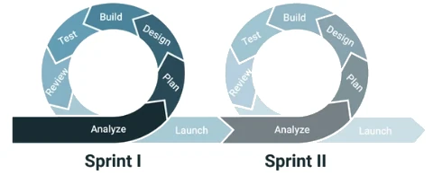
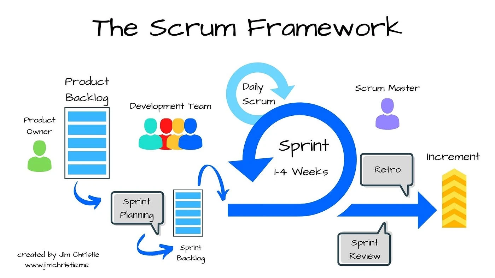

# Scrum

---

## C'est quoi ?

- Scrum : mêlée (de rugby)
- framework Agile
- très utilisé
- itératif
- basé sur la collaboration
- fondements en 1986 puis 1995 (communication)
- formalisation en 2002
- [Guide Scrum](https://scrumguides.org/docs/scrumguide/v2020/2020-Scrum-Guide-French.pdf) en 2010

--

## Comment ?

- équipes pluridisciplinaires et auto-organisées
- produits réalisés de façon itérative et incrémentale
- des cycles de 1 mois ou moins
- des rôles
- des événements / cérémonies / rituels
- des livrables

---

## Sprint

**Sprint** : pointe de vitesse

c’est le **cœur de Scrum** ! ❤️

un Sprint = un cycle de réalisation = une itération

**objectifs** de réalisation **fixés avant** le Sprint

on **ne change pas** les objectifs du Sprint

on peut annuler un Sprint

 <!-- .element style="padding: .5rem 1rem;background-color: #fff" -->

--

**Sprint**

durée : **jusqu’à** 1 mois (1 à 4 semaines en général)

**durée fixe** pendant toute la durée du projet

débute et termine à des dates précises

si le travail n’est pas terminé à la fin : Sprint en échec

si le travail est terminé, il est livré

 <!-- .element style="padding: .5rem 1rem;background-color: #fff" -->

---

## La Scrum Team

- petite équipe projet
  - pluridisciplinaire
  - toutes les compétences pour réaliser le Sprint
  - petite pour être réactive
- un Scrum Master
- un Product Owner
- les Developers
  - c'est l'équipe de réalisation

---

## Les rôles

différents de ceux de la conduite de projet “classique” !

**Product Owner** : directeur produit

**Scrum Master** : chef de mêlée

**Developers** : équipe de réalisation

Si on vous parle de chef de projet Scrum, c'est qu'il y a un problème...

--

### Les rôles : Product Owner

- responsable du produit
- expert métier
- formule les besoins
- gère et communique les besoins
- s’assure que les besoins sont compris

--

### Les rôles : Scrum Master

- facilitateur du projet
- protège l’équipe des perturbations extérieures
- responsable du projet
- s’assure du respect de la méthode Scrum
- peut être un Developer
- **ne peut pas être Product Owner**

--

### Les rôles : Developers

- équipe de réalisation
- construit le projet
- travaillent les uns avec les autres
- administrateurs systèmes, analystes, concepteurs, développeurs, UI / UX designer, architectes...

---

## Les Artefacts

Ce sont les livrables

**Product Backlog** : carnet de produit

**Sprint Backlog** : carnet de sprint

**Product Increment** : incrément de produit

--

### Les Artefacts : Product Backlog

- liste ordonnée de ce qui est nécessaire pour le produit
- centralise ce doit être fait (besoins, exigences, fonctionnalités…)
- liste priorisée
- gérée par le Product Owner
- peut évoluer pendant le projet

--

### Les Artefacts : Sprint Backlog

- liste des tâches d’un Sprint
- tâches issues du Product Backlog
- les objectifs du Sprint ne changent pas
- mais l’état est mis à jour tous les jours
- géré par les Developers

--

### Les Artefacts : Product Increment

- réalisation du Sprint
- est ajouté aux incréments précédents
- permet d’avancer vers le produit définitif
- est aligné sur le DoD  
  (*Definition of Done* : ensemble des conditions nécessaires pour considérer un élément comme terminé et livrable, ex: serveur provisionné, configuré, tests OK, documenté)

---

## Les Événements

**Sprint** : pointe de vitesse

**Sprint Planning** : planification du Sprint

**Daily Scrum** : mêlée quotidienne

**Sprint Review** : revue de Sprint

**Sprint Restrospective** : rétrospective du Sprint

--

### Les Événements : Sprint Planning

- planification du Sprint
- création du Sprint Backlog
- explication du Sprint (pourquoi, que faire, comment ?)
- Product Owner, Scrum Master, Developers
- durée : max 8h pour Sprint de 1 mois

--

### Les Événements : Daily Scrum

- rituel quotidien, heure et lieu fixes
- permet de suivre le plan de développement
  - ce qui est fait
  - ce qui est à faire aujourd’hui
  - les problèmes
- Scrum Master, Developers, si besoin Product Owner
- durée : 15 minutes

--

### Les Événements : Sprint Review

- inspection du résultat du Sprint
- déterminer vers où il faut aller
- voir ce qui a changé dans l’environnement
- Product Owner, Scrum Master, Developers
- durée : max 4h pour Sprint de 1 mois

--

### Les Événements : Sprint Retrospective

- rituel de fin de Sprint
- réflexions sur l’amélioration de la qualité et de l’efficacité (outils, interactions, communication…)
- vise à améliorer le quotidien de l’équipe
- Scrum Master, Developers, si besoin Product Owner
- durée : max 3h pour Sprint de 1 mois

---

## Schéma de synthèse

---

## Exemple d'un projet Scrum

### Contexte

Projet de mise en place d’un environnement de supervision pour 50 serveurs d’entreprise.

--

| Sprint | Objectifs | Livrables | Backlog / Notes |
|--------|-----------|-----------|----------------|
| **Sprint 0** (2 sem) | - Définir l’infrastructure cible - Identifier besoins utilisateurs - Préparer environnement test | - Doc architecture cible - Backlog initial - Environnement de test prêt | - Collecte des besoins - Identification des contraintes - Mise en place du repo / serveur test |
| **Sprint 1** (2 sem) | - Installer outil de supervision (Zabbix) - Configurer agents sur 10 serveurs - Vérifier métriques CPU/RAM/disque | - Supervision sur 10 serveurs - Doc installation & config - Backlog mis à jour | - Création template d’agent - Tests remontée métriques - Feedback PO |

--

| Sprint | Objectifs | Livrables | Backlog / Notes |
|--------|-----------|-----------|----------------|
| **Sprint 2** (2 sem) | - Déployer sur 20 serveurs supplémentaires - Configurer alertes email/SMS - Commencer dashboards | - Supervision sur 30 serveurs - Alerting opérationnel - Documentation mise à jour | - Prioriser alertes critiques - Ajuster dashboards - Retours des utilisateurs |
| **Sprint 3** (2 sem) | - Déployer sur 20 serveurs restants - Dashboards complets et reporting - Ajuster seuils alertes - Ajouter métriques réseau et stockage - Former l’équipe IT | - Supervision complète 50 serveurs - Dashboards et alerting optimisés - Documentation finale - Formation / transfert de connaissances | - Feedback final PO - Validation DoD - Préparer guide utilisateurs |

---

## Conclusion

Scrum est un **framework Agile** qui organise le travail en **itérations courtes (Sprints)** et repose sur des **rôles clairs**, des **artefacts concrets** et des **événements réguliers**.

Scrum permet de **livrer rapidement et régulièrement** des incréments de produit, **s'adapter aux changements** de besoins ou d’environnement, d'**améliorer la collaboration et la transparence** au sein de l’équipe et de **mesurer et améliorer continuellement** l’efficacité et la qualité.

Tous les projets ne peuvent pas être Scrum !
