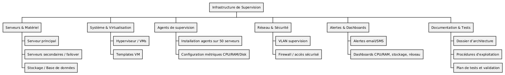
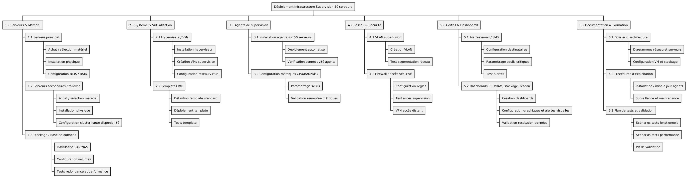
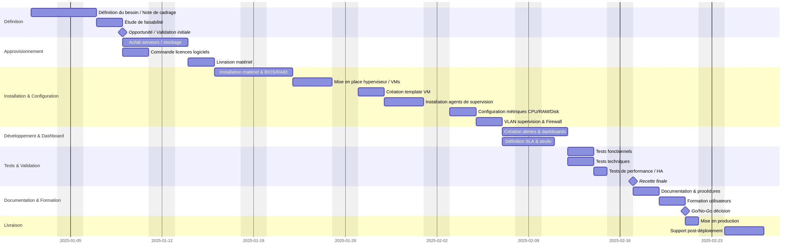

# Outils de la gestion de projet

---

## Introduction

La gestion de projet passe par des méthodes ou cadre, des rôles et responsabilités, mais également par des outils.

Nous allons voir ici différents outils. Dans un projet on n'utilise pas forcément tous les outils, mais il est intéressant d'en connaître plusieurs pour choisir ceux en adéquation avec le projet !

---

## Structuration du projet

Les outils de structuration de projet permettent d'avoir une vision synthétique du produit et des tâches nécessaires à la réalisation.

--

### PBS

*[Product Breakdown Structure](https://fr.wikipedia.org/wiki/Structure_de_d%C3%A9composition_du_produit)* : découpage du produit

Le PBS est orienté sur le produit et ce qui compose le produit, sous forme de représentation graphique.

--

PBS simplifiée pour le projet “Déploiement d’une infrastructure de supervision pour 50 serveurs”

 <!-- .element style="padding: .5rem 1.5rem; background-color: #fff" -->

--

#### PBS : méthode de construction

- Définir le **produit final**
- Identifier les **grandes familles** de livrables
- Décomposer chaque famille en **sous-produits**
- Décomposer jusqu’au niveau **livrable élémentaire**
- Vérifier la cohérence

--

### WBS

*[Work Breakdown Structure](https://fr.wikipedia.org/wiki/Organigramme_des_t%C3%A2ches_du_projet)* : découpage des tâches du projet

Le WBS est orienté sur les tâches du projet, on décompose le projet avec toutes les tâches, les actions à réaliser.

--

WBS détaillé pour le projet "Déploiement d’une infrastructure de supervision pour 50 serveurs"

  <!-- .element style="padding: .5rem 1.5rem; background-color: #fff" -->

--

#### WBS : méthode de construction

- Définir les **livrables**
- Décomposer en **lots de travail (Work Packages)**
- Décomposer en **tâches**
- Vérifier que chaque tâche est unique, mesurable, datable

---

## Planification et affectation des ressources

Ces outils permettent d'avoir une vue d'ensemble des ressources, des tâches et de l'affectation des ressources aux tâches dans le temps.

--

### RACI

La matrice RACI indique les rôles et responsabilités des acteurs du projet.

- **R**esponsible : réalisateur
- **A**ccountable : approbateur
- **C**onsulted : consulté
- **I**nformed : informé

--

RACI (extrait) pour le projet "Déploiement d’une infrastructure de supervision pour 50 serveurs"

| Étape / Livrable                                   | MOA (Client) | Chef de projet | Administrateur système | Équipe Réseau | DevOps | RSSI | Utilisateurs finaux |
| -------------------------------------------------- | ------------ | -------------- | ---------------------- | ------------- | -------------------- | --------------- | ------------------- |
| 1. Définition du besoin / Note de cadrage          | A            | R              | C                      | C             | C                    | C               | I                   |
| 2. Étude de faisabilité                            | C            | R              | C                      | C             | C                    | C               | I                   |
| 3. Acquisition serveurs / stockage                 | I            | R              | A                      | C             | I                    | C               | I                   |

--

#### RACI : méthode de construction

- Identifier les activités / livrables du projet (PBS / WBS peuvent aider !)
- Identifier les parties prenantes / rôles (ne pas oublier le support, les fournisseurs...)
- Définir les responsabilités RACI
  - Chaque tâche doit avoir au moins un R et un A.
  - Un A peut être aussi R si la personne réalise et valide elle-même
  - Les C et I peuvent être multiples
  - Idéalement un seul A par tâche pour éviter les conflits de décision
- Remplir la matrice
- Vérifier et valider

--

### Diagramme de Gantt

Il permet de visualiser :

- les tâches
- les durées
- les dépendances
- les ressources affectées
- les jalons

--

Jalon : événement significatif sans durée

- installation terminée
- recette validée
- documentation livrée

--

Diagramme de Gantt pour le projet "Déploiement d’une infrastructure de supervision pour 50 serveurs"

<small>Sur ce diagramme les affectations de ressources ne sont pas présentes</small>

--

#### Diagramme de Gantt : méthode de construction

- Identifier les phases du projet (les PBS et WBS peuvent aider !)
- Décomposer en tâches (les PBS et WBS peuvent aider !)
- Définir les dépendances (liens entre des tâches)
- Estimer la durée de chaque tâche
- Paralléliser les tâches qui peuvent l'être
- Créer le diagramme
- Affecter les ressources
- Vérifier la cohérence et valider
- Mettre à jour selon l'avancement réel

--

### Kanban

Méthode visuelle d'organisation de tâches.

Vient du japonais カンバン ou 看板 (kanban, « étiquette »)

Très utile pour un petit projet ou une organisation personnelle.

--

#### Kanban : principes

--

**Kanban : principes**

Une carte descriptive d’une action à réaliser (on peut y mettre les infos que l'on veut ou normaliser les cartes)

Posée sur un tableau avec plusieurs statuts pour l’action :

- à faire (to do)
- en cours (doing / in progress)
- fait (done)

On glisse la carte dans la colonne qui correspond à son statut.

Les colonnes du tableau sont personnalisables.

---

## Suivi de projet

Le suivi de projet permet :

- de détecter les dérives
- d'anticiper les risques
- d'ajuster les ressources
- de décider rapidement des actions correctives

--

### KPI

*KPI* : *Key Performance Indicators*, indicateurs clés de performance

Permet de mesurer une performance. Dans le cadre d'un projet, de suivre l'avancement du projet.

On détermine quelques indicateurs (pas trop pour ne pas s'y perdre) qui doivent être significatifs par rapport au projet.

Les KPI doivent être actualisés régulièrement pour refléter l'état du projet.

--

#### KPI classiques

⏱ Délais

- Respect du planning : % de tâches livrées dans les délais
- Respect des jalons : nombre de jalons atteints à temps
- Durée totale du projet : prévisionnelle vs réelle

**💰 Coût**

- Coût réel par rapport au coût prévisionnel
- Taux de consommation du budget
- Coût des imprévus / demandes supplémentaires

**👥 Charge / Capacité**

- Charge consommée par rapport à la charge prévue
- Taux d’utilisation des ressources
- Taux de surcharge / sous-charge des équipes

--

### Tableau de bord

Outil de pilotage qui regroupe les informations clés permettant de **suivre l’avancement**, **anticiper les risques** et **prendre des décisions rapides**.

Présente les **KPI**, **alertes**, **tendances** et éléments structurants du projet sous forme **visuelle** et **synthétique**.

--

#### Tableau de bord : objectifs

 <!-- .element style="display: grid; grid-template-columns: 1fr 1fr; gap: 1rem" -->

📊 Suivre l’état du projet

- Avancement global (en %)
- État des tâches clés
- État des jalons

💬 Améliorer la communication

- Support de réunion de pilotage
- Données partagées avec la MOA / MOE
- Alignement des équipes

📆 Anticiper les dérives

- Dérapage planning
- Surconsommation budgétaire
- Retards fournisseurs
- Indisponibilités ressources
- Dérives techniques détectées pendant les tests

🤷‍♂️ Aider la décision

- Priorisation
- Arbitrages
- Ajustement des ressources
- Gestion de crise

--

##### 🚦 Tableau de bord Projet

**Déploiement d’une infrastructure de supervision pour 50 serveurs**

 <!-- .element style="display: grid; grid-template-columns: 1fr 1fr; gap: 1rem;font-size: 1.25rem" -->

🧭 ***Vue d’ensemble***

**Statut global :** 🟠 *Sous surveillance*  
**Chef de projet :** A. Martin  
**Périmètre :** Supervision complète (agents, dashboards, alerting)  
**Échéance :** 12 semaines  
**Avancement :** **42%**

📊 ***Indicateurs***

| Domaine        | Statut | Commentaire rapide |
|----------------|--------|--------------------|
| Planning       | 🟢 | Avancement nominal |
| Budget         | 🟢 | Pas de dérive constatée |
| Qualité tests  | 🟠 | 5 serveurs avec agents instables |
| Risques        | 🟠 | Retard possible côté fournisseur plug-in |
| Ressources     | 🟢 | Équipe conforme au staffing |

📈 ***Avancement***

**Agents déployés :** 26 / 50 (52%)  
**Dashboards créés :** 3 / 5 (60%)  
**Alertes critiques configurées :** 12 / 20 (40%)  
**Serveur de supervision prêt :** ✔ OK  
**Tests de charge :** ⏳ Prévu Semaine 5  

🔥 ***Risques & Actions***

**Risque 1 — Plug-in non livré à temps**

*Impact :* retard de 1–2 semaines  
*Probabilité :* moyenne  
*Action :* relance fournisseur + scénario B sans ce plug-in

 <!-- .element style="grid-column-start: 1; grid-column-end: 3" -->

📌 ***Actions en cours / décisions***

Valider la liste finale des alertes critiques  
Arbitrer entre plugin officiel ⇢ plugin custom  
Confirmer planning des tests de charge

---

## Communication

La communication est un élément clé d'un projet. Cela permet d'**informer les parties prenantes** sur le projet, d'**assurer l'alignement** sur les objectifs, le planning, les livrables, d'**éviter les erreurs**, d'**obtenir validation** et d'**anticiper les blocages**.

Une bonne communication projet est un facteur de **motivation et d’engagement** des équipes.

--

### Les supports classiques

| Support                                    | Objectif                                     | Fréquence / Exemple   |
| ------------------------------------------ | -------------------------------------------- | --------------------- |
| **Réunions de pilotage (COPIL)**           | Décision stratégique, suivi global           | 1x par semaine / mois |
| **Comité technique (COTECH)**              | Suivi des tâches techniques, arbitrages      | Hebdomadaire          |
| **Rapports d’avancement / status reports** | Synthèse chiffrée (KPI, avancement, risques) | Hebdo / bi-hebdo      |
| **Tableaux de bord**                       | Vue synthétique des KPI et alertes           | Mis à jour en continu |
| **Emails ciblés**                          | Information rapide et formelle               | Selon besoins         |
| **Wikis / Docs partagés**                  | Documentation, procédures, notes             | Mise à jour continue  |
| **Kanban / boards collaboratifs**          | Visualiser l’avancement, tâches              | Temps réel            |

--

### Types de communication

- **ascendante** : équipe → direction
- **descendante** : direction → équipe
- **transversale** : entre équipes techniques
- **vers l’utilisateur** : informations, consignes, mises en production

--

### Types de communication par parties prenantes

| Partie prenante                 | Objectif                          | Fréquence / Support                      |
| ------------------------------- | --------------------------------- | ---------------------------------------- |
| **Direction / Sponsor**         | Décision, arbitrage, budget       | COPIL / rapports synthétiques            |
| **MOA / Métier**                | Suivi du périmètre, besoins       | Réunions régulières / rapports, KPI      |
| **MOE / équipes techniques**    | Coordination, tâches, dépendances | COTECH / Kanban / wiki                   |
| **Utilisateurs finaux**         | Adoption, tests, retour           | Newsletter, mails, sessions de formation |
| **Fournisseurs / prestataires** | Délais, livrables, incidents      | Réunions contractuelles / mails          |

<small>
⚠️ les utilisateurs finaux sont trop souvent oubliés dans la communication ! D'où incompréhension, frustration et mauvaise adhésion au changement
</small>

--

### Bonnes pratiques

- être synthétique, clair et concis
- avoir un discours adapté au public
- avoir une fréquence adaptée et régulière
- être transparent, partager les risques et difficultés, pas seulement les succès
- utiliser les bons outils, dont les outils collaboratifs
- désigner un référent communication et établir un document des fréquences, publics et contenus de communication

---

## Conclusion

Beaucoup d'outils existent pour une gestion de projet efficace. Il n'est pas nécessaire de tous les utiliser.

Il est essentiel de bien définir les rôles, responsabilités et formes de communication.

Les outils de structuration et de suivi dépendent fortement du projet.

L'usage d’**outils structurants**, de **suivi rigoureux** et d'une **bonne communication** constitue le socle d’une gestion de projet efficace.